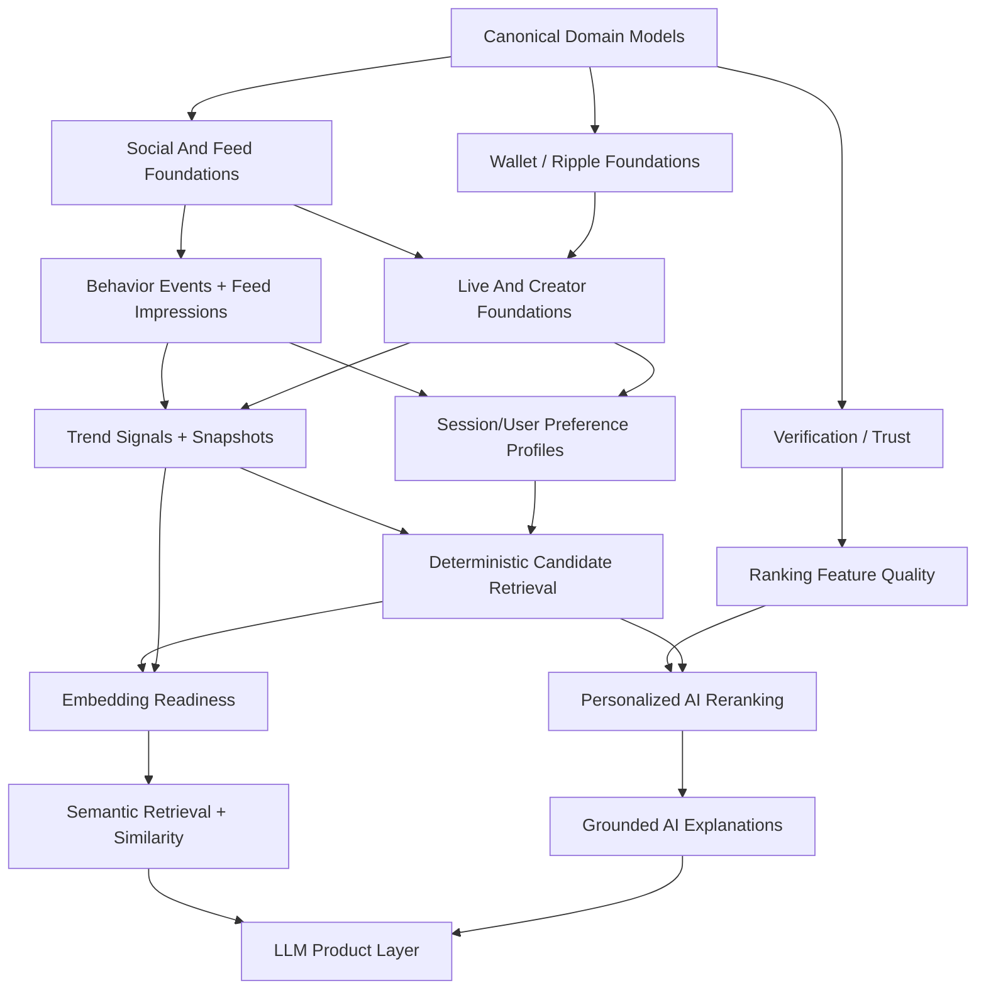

# Ripples — AI Readiness Roadmap

> Living roadmap for building Ripples in an AI-ready way without forcing AI
> into parts of the platform before the data, retrieval, and product
> architecture are ready.

---

## 1. Purpose

This document exists to ensure that:

- the platform is built in the right order
- models and events that may later power AI are designed from day one to be
  AI-ready
- we separate deterministic platform infrastructure from later AI layers
- every AI use case has explicit prerequisites
- the roadmap can be updated as the product evolves

This document should be read alongside:

- [SRS](/Users/juliusossim/Documents/ripples/docs/ripples-srs.md)
- [ERD Blueprint](/Users/juliusossim/Documents/ripples/docs/ripples-erd.md)
- [Domain Matrix](/Users/juliusossim/Documents/ripples/docs/ripples-domain-matrix.md)
- [Relationship And Constraints Spec](/Users/juliusossim/Documents/ripples/docs/ripples-relationship-constraints-spec.md)
- [AI Feed Foundations Tracker](/Users/juliusossim/Documents/ripples/docs/ripples-implementation-tracker.md)
- [Product Outcome Tracker](/Users/juliusossim/Documents/ripples/docs/ripples-product-outcome-tracker.md)
- [Scope Ownership Matrix](/Users/juliusossim/Documents/ripples/docs/ripples-scope-ownership-matrix.md)

---

## 2. Core Principle

Ripples should be built as:

1. a strong real estate and social-commerce platform first
2. a measurable recommendation system second
3. an AI-powered ranking and intelligence platform third

This means:

- no embeddings before there is real semantic retrieval demand
- no LLM-driven ranking before there is reliable candidate generation
- no “personalized AI feed” before identity, session, trend, and location
  signals are trustworthy

---

## 3. AI-Ready Definition

A model, event, or feature is considered `AI-ready` when it satisfies all of
the following:

- canonical identity and ownership are defined
- fields are structured and queryable
- timestamps are reliable
- enums are stable and explicit
- status transitions are well-defined
- location, attribution, and source metadata are preserved where relevant
- events around the entity are logged consistently
- the entity can participate in retrieval and ranking without lossy conversion

---

## 4. AI-Ready Design Rules

All future platform work should follow these rules.

### 4.1 Models

- prefer canonical root entities over ambiguous duplicated records
- keep `Property` separate from `Listing`
- keep `Property` separate from `Product`
- keep `ContentPost` separate from `LiveSession`
- model `Address` as a lightly normalized reusable root
- preserve verification and trust states explicitly
- use explicit enums for lifecycle and action types

### 4.2 Events

- every user-visible feed item should support impression logging
- every interaction event should include:
  - `userId?`
  - `sessionId`
  - `entityId`
  - `entityType`
  - `createdAt`
  - optional contextual metadata
- avoid event schemas that collapse different intents into vague payloads

### 4.3 Retrieval And Ranking

- candidate retrieval should be deterministic and explainable before AI reranking
- ranking features should be materializable into read models
- explanation strings should be grounded in stored ranking reasons

### 4.4 AI Layers

- retrieval first
- structured ranking next
- personalized reranking after that
- embeddings only when semantic scale justifies them
- LLMs last, and only when grounded by structured signals

---

## 5. Current State Summary

As of the current repo state:

- canonical property and listing foundations exist
- behavior events exist
- a heuristic feed exists
- feed scoring currently uses deterministic recency and engagement heuristics
- visitor and signed-in users currently receive essentially the same backend feed
- location is present on properties but not yet used for viewer-aware ranking
- real persisted mixed content is not yet fully in place
- trend snapshots and user preference read models do not yet exist
- there is no true AI retrieval, embedding, or model-based reranking yet

So Ripples is currently:

- `AI-aware` in direction
- not yet `AI-ready` for recommendation intelligence in production

---

## 6. Build Order

This is the recommended implementation order for the platform.

## Phase 1 — Canonical Platform Foundations

Goal:
- lock the canonical business model
- ensure all major entities are AI-ready in structure

Build:
- `User`
- `AuthIdentity`
- `Session`
- `UserProfile`
- `Organization`
- `OrganizationMembership`
- `Address`
- `AddressAssignment`
- `AddressVerification`
- `ServiceZone`
- `Property`
- `PropertyOwnership`
- `PropertyMedia`
- `PropertyDocument`
- `PropertyDocumentVerification`
- `Listing`
- `ListingAssignment`
- `ListingSuitabilityProfile`
- `ListingEligibilityPolicy`
- `ListingOccupancyProfile`
- `ListingPaymentTerms`
- `Product`
- `ProductVariant`
- `Brand`
- `Supplier`
- `Wallet`
- `WalletAccount`
- `LedgerEntry`

AI-ready outcome:
- clean domain foundations
- explicit ownership
- usable location and trust metadata
- future ranking entities have canonical identities

## Phase 2 — Social And Feed Foundations

Goal:
- make the platform measurable and feed-native

Build:
- `ContentPost`
- `ContentMedia`
- `Comment`
- `Reaction`
- `Save`
- `Share`
- `Follow`
- `Campaign`
- `ReferralLink`
- `FeedImpression`
- expanded `BehaviorEvent`
- `FeedQueryDto`
- viewer context support:
  - `userId?`
  - `sessionId`
  - location context

AI-ready outcome:
- real feed inventory
- event-rich content graph
- structured interaction trails

## Phase 3 — Live And Creator Economy Foundations

Goal:
- support real-time social commerce and creator distribution

Build:
- `CreatorProfile`
- `CreatorProgram`
- `LiveSession`
- `LiveViewerSession`
- `LiveChatMessage`
- `LiveReaction`
- `LiveGift`
- `LiveOffer`
- `LiveConversionEvent`
- `CommissionRule`
- `CommissionLedgerEntry`
- `RippleReward`
- `RippleSpend`

AI-ready outcome:
- creator and live signals become first-class
- feed can rank more than static listings

## Phase 4 — Trend And Read-Model Infrastructure

Goal:
- make trend, locality, and preference data queryable

Build:
- `TrendSignal`
- `TrendingSnapshot`
- `EntityEngagementSummary`
- `LocalTrendSnapshot`
- `SessionPreferenceProfile`
- `UserPreferenceProfile`
- `LocationAffinitySummary`
- `CreatorAffinitySummary`
- `ListingTypeAffinitySummary`
- `PriceBandAffinitySummary`
- `RankingFeatureSnapshot`

AI-ready outcome:
- candidate retrieval can be diverse and fast
- personalization inputs exist
- trend is computed rather than guessed

## Phase 5 — Deterministic Personalized Retrieval

Goal:
- produce viewer-specific candidate sets without ML dependency

Build:
- candidate retrieval services for:
  - nearby listings
  - trending local listings
  - followed creators/agencies
  - similar saved inventory
  - live sessions with momentum
  - promoted inventory
  - property-adjacent products
- diversity and freshness rules
- deterministic explanation generation

AI-ready outcome:
- strong feed candidate pools
- honest “for you” behavior before AI reranking

## Phase 6 — First AI Ranking Layer

Goal:
- introduce AI where the substrate is already strong

Build:
- personalized reranking service
- grounded explanation layer
- evaluation pipeline for ranking quality
- feature store or ranking feature projection

AI-ready outcome:
- AI improves ordering, not foundational retrieval

## Phase 7 — Embeddings And Semantic Intelligence

Goal:
- add semantic retrieval only when content scale justifies it

Build:
- embedding generation pipeline
- embedding refresh and invalidation strategy
- semantic candidate retrieval
- similar-item and similar-content services

AI-ready outcome:
- cross-domain semantic discovery
- richer search and similarity

## Phase 8 — LLM Product Layer

Goal:
- use LLMs for grounded intelligence, not unsupported magic

Build:
- grounded recommendation explanations
- listing summarization
- market update summarization
- moderation support
- creator content assistance
- intelligent assistant / concierge workflows

---

## 7. Dependency Graph

---

## 8. AI-Ready Model Inventory

The following models and data points must be designed with future AI use in
mind.

## 8.1 Retrieval Entities

- `Property`
- `Listing`
- `ContentPost`
- `LiveSession`
- `CreatorProfile`
- `Product`

These should always preserve:

- stable IDs
- created and updated timestamps
- author / owner / source
- media presence
- category / type labels
- location metadata where relevant
- trust / verification state

## 8.2 User And Session Signals

- `User`
- `Session`
- `OrganizationMembership`
- `Follow`
- `Save`
- `Reaction`
- `Share`
- `Comment`
- `LiveViewerSession`
- `Wallet`
- `LedgerEntry`

These should preserve:

- actor identity
- session identity
- event time
- attribution source
- privacy-safe aggregation paths

## 8.3 Trust And Quality Inputs

- `AddressVerification`
- `PropertyDocumentVerification`
- `Verification`
- listing status and moderation state
- profile verification
- organization trust signals

These should be usable as ranking and suppression features later.

## 8.4 Economic Signals

- `RippleReward`
- `RippleSpend`
- `CommissionLedgerEntry`
- `LiveGift`
- `Payment`
- `Transaction`
- `EscrowAccount`

These should support later analytics for:

- creator influence
- conversion quality
- gift velocity
- purchase intent
- monetization-aware trend signals

---

## 9. Required Event Taxonomy Before AI

The following event set should exist before real AI ranking work begins.

### Feed And Discovery

- `feed_open`
- `feed_impression`
- `feed_scroll`
- `hide_feed_item`
- `dismiss_feed_reason`

### Listing And Property

- `view_property`
- `like_property`
- `save_property`
- `share_property`
- `expand_property_details`
- `click_listing_cta`
- `contact_agent`
- `book_viewing`

### Content And Creator

- `view_content_post`
- `like_content_post`
- `save_content_post`
- `share_content_post`
- `follow_creator`
- `follow_organization`

### Live

- `open_live`
- `join_live`
- `leave_live`
- `send_live_reaction`
- `send_live_message`
- `gift_creator`
- `click_live_offer`
- `convert_from_live`

### Commerce And Finance

- `start_checkout`
- `complete_purchase`
- `pay_with_ripple`
- `boost_listing`
- `redeem_reward`

---

## 10. Read Models Required Before AI Reranking

These should exist before model-based ranking is introduced.

- `EntityEngagementSummary`
- `LocalTrendSnapshot`
- `TrendingSnapshot`
- `SessionPreferenceProfile`
- `UserPreferenceProfile`
- `CreatorAffinitySummary`
- `LocationAffinitySummary`
- `ListingTypeAffinitySummary`
- `PriceBandAffinitySummary`
- `RankingFeatureSnapshot`

These read models should be:

- cheap to query
- refreshable in the background
- explainable
- versionable if ranking logic changes

---

## 11. AI Use Cases And Their Readiness Gates

## 11.1 Use Case: Honest Feed Explanations

Examples:
- `Just listed`
- `Trending near you`
- `Popular with buyers`

Prerequisites:
- structured score breakdown
- trend signals
- viewer location context

AI required:
- no

Recommended phase:
- Phase 4 or 5

## 11.2 Use Case: Visitor Feed Personalization

Examples:
- session-aware ranking
- local-first cold start

Prerequisites:
- `Session`
- impression tracking
- session preference summaries
- location-aware retrieval

AI required:
- no initially

Recommended phase:
- Phase 5

## 11.3 Use Case: Signed-In Feed Personalization

Examples:
- based on saves, follows, views, lives watched

Prerequisites:
- user behavior history
- user preference summaries
- candidate retrieval sources
- trend snapshots

AI required:
- optional first, recommended later

Recommended phase:
- Phase 5 for deterministic
- Phase 6 for AI reranking

## 11.4 Use Case: Trending Properties / Events / Creators

Prerequisites:
- event windows
- trend aggregation
- entity-specific momentum signals

AI required:
- no

Recommended phase:
- Phase 4

## 11.5 Use Case: “Similar Listings” Or “Similar Content”

Prerequisites:
- content volume
- structured features
- semantic need
- background embedding pipeline

AI required:
- yes, if semantic similarity is desired

Recommended phase:
- Phase 7

## 11.6 Use Case: Feed AI Reranking

Prerequisites:
- deterministic candidate retrieval
- ranking feature snapshots
- evaluation metrics
- user/session preference profiles
- trend snapshots

AI required:
- yes

Recommended phase:
- Phase 6

## 11.7 Use Case: LLM-Generated Recommendations And Summaries

Prerequisites:
- grounded structured signals
- trusted content sources
- explanation source fields

AI required:
- yes

Recommended phase:
- Phase 8

## 11.8 Use Case: AI Concierge / Search Assistant

Prerequisites:
- canonical domain model
- retrieval APIs
- filters and search
- optional semantic retrieval
- policy-safe prompt grounding

AI required:
- yes

Recommended phase:
- Phase 8

---

## 12. Readiness Gates For Embeddings

Embeddings should not be introduced until all of the following are true:

- there is enough content volume to justify semantic retrieval
- content includes rich text or metadata beyond simple structured filters
- candidate retrieval from structured filters is no longer sufficient
- there is infrastructure for background embedding generation
- there is a plan for embedding refresh and invalidation
- the use case is clearly semantic, not just a ranking problem

If any of those are missing, embeddings are premature.

---

## 13. Readiness Gates For LLM Ranking Or Explanation

LLMs should not be used to decide ranking unless:

- candidate retrieval is already strong
- structured ranking features exist
- explanations are grounded in factual inputs
- there is evaluation for ranking quality and regression

LLMs may be used earlier for:

- copy polishing
- summarization
- content assistance

But not for core feed ordering.

---

## 14. Step-By-Step Implementation Checklist

## Step 1

Finish and stabilize canonical domain models and APIs.

## Step 2

Expand feed inventory from properties-only to real persisted mixed content:

- `ContentPost`
- `LiveSession`
- creator-driven content

## Step 3

Introduce `FeedQueryDto` and viewer context:

- `limit`
- `cursor`
- `sessionId`
- optional `userId`
- optional location context
- feed mode

## Step 4

Instrument feed impressions and deeper interactions.

## Step 5

Build trend aggregation and snapshots.

## Step 6

Build session and user preference summaries.

## Step 7

Implement deterministic candidate retrieval and blending.

## Step 8

Implement deterministic personalized ranking and grounded explanations.

## Step 9

Add ranking feature snapshots and evaluation.

## Step 10

Introduce AI reranking for signed-in and session-based feeds.

## Step 11

Introduce embeddings only for justified semantic retrieval use cases.

## Step 12

Add grounded LLM experiences on top.

---

## 15. Update Rules For This Document

Whenever a major domain, event stream, or retrieval path is added, update this
document to reflect:

- what phase it belongs to
- whether it is a prerequisite, enabler, or direct AI layer
- which use cases it unlocks
- whether it changes build order or dependencies

Recommended update triggers:

- new canonical model accepted
- new event type added
- new feed source added
- live or creator flows expanded
- trend logic introduced
- wallet / Ripple economy expanded
- first ranking evaluation framework added
- first embedding or LLM service introduced

---

## 16. Current Recommendation

The immediate next priorities for Ripples should be:

1. real persisted mixed feed content
2. feed DTO and viewer context
3. impression and richer event instrumentation
4. trend and preference read models
5. deterministic personalized retrieval

Only after that should we move into:

6. AI reranking
7. semantic retrieval with embeddings
8. LLM-generated intelligence layers
