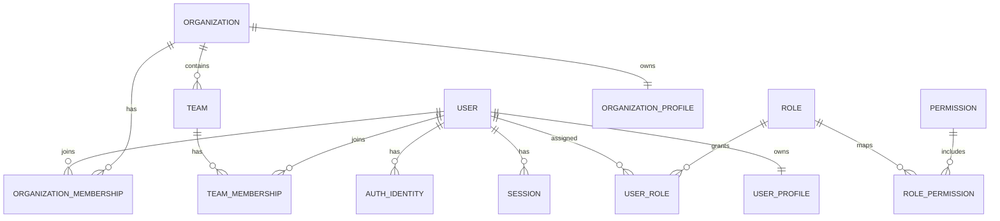
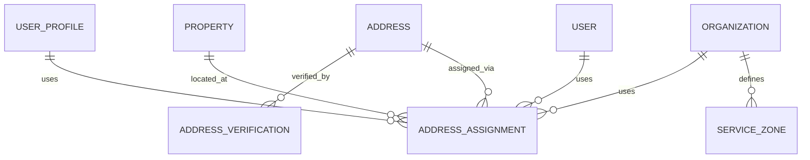
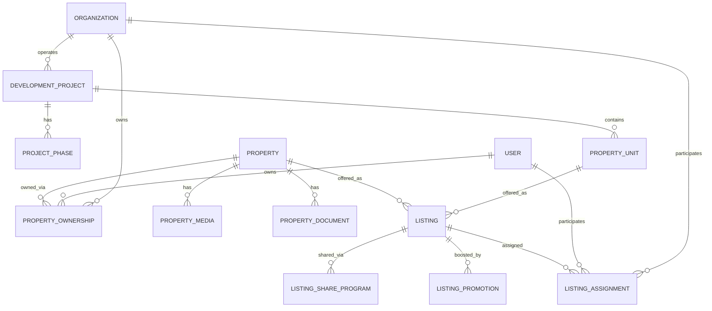
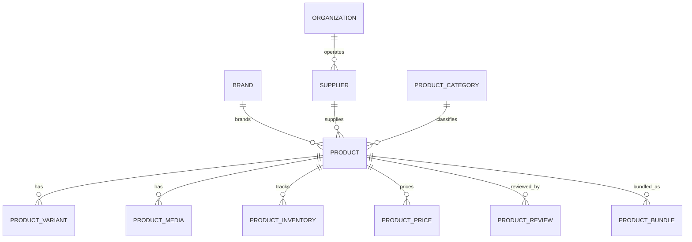
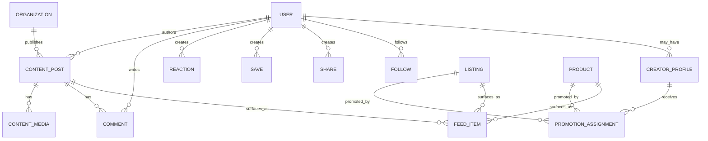
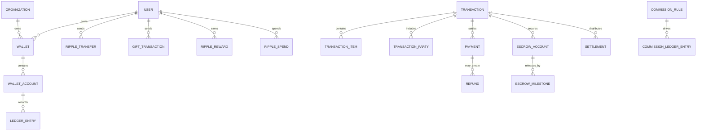
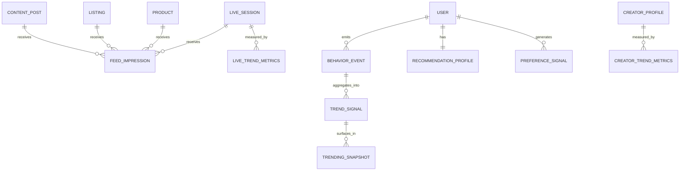

# Ripples — ERD Blueprint

> Conceptual entity relationship blueprint for Ripples. This is not yet the
> final Prisma schema; it is the model map we will refine into concrete tables,
> joins, and constraints.

---

## 1. Modeling Principles

- one base `User` identity
- organizations modeled through `Organization`
- personas expressed through roles, memberships, and profiles
- `Property` and `Listing` remain separate
- `Product` and `Property` remain separate
- `Ripple` is ledger-based
- trending is computed from event streams and snapshots

---

## 2. High-Level Relationship Groups

### 2.1 Identity And Organizations

### 2.1.5 Address, Verification, And Zones

### 2.2 Property, Project, And Listing

### 2.3 Product Commerce

### 2.4 Social, Content, And Feed

### 2.5 Live Domain

```mermaid
erDiagram
    LIVE_SESSION ||--o{ LIVE_SCHEDULE : scheduled_by
    LIVE_SESSION ||--o{ LIVE_HOST : hosted_by
    LIVE_SESSION ||--o{ LIVE_COHOST : cohosted_by
    LIVE_SESSION ||--o{ LIVE_LISTING_SPOTLIGHT : spotlights
    LIVE_SESSION ||--o{ LIVE_VIEWER_SESSION : attends
    LIVE_SESSION ||--o{ LIVE_CHAT_MESSAGE : has
    LIVE_SESSION ||--o{ LIVE_REACTION : has
    LIVE_SESSION ||--o{ LIVE_QUESTION : has
    LIVE_SESSION ||--o{ LIVE_POLL : has
    LIVE_SESSION ||--o{ LIVE_OFFER : creates
    LIVE_SESSION ||--o{ LIVE_GIFT : receives
    LIVE_SESSION ||--o{ LIVE_REPLAY : produces
    LIVE_SESSION ||--o{ LIVE_CONVERSION_EVENT : converts
    USER ||--o{ LIVE_VIEWER_SESSION : participates
    USER ||--o{ LIVE_CHAT_MESSAGE : sends
```

### 2.6 Wallet, Ripple, Payment, And Transaction

### 2.7 Trending, Analytics, And Recommendation

---

## 3. Core Entity Definitions

### 3.1 Root Entities

- `User`
- `Organization`
- `Property`
- `Listing`
- `DevelopmentProject`
- `PropertyUnit`
- `Product`
- `ContentPost`
- `LiveSession`
- `Wallet`
- `Transaction`
- `Lead`
- `Conversation`
- `Address`
- `AddressVerification`
- `ServiceZone`

### 3.2 Join Entities

- `UserRole`
- `RolePermission`
- `OrganizationMembership`
- `TeamMembership`
- `AddressAssignment`
- `PropertyOwnership`
- `ListingAssignment`
- `PromotionAssignment`
- `TransactionParty`
- `Follow`

### 3.3 Derived / Read Models

- `FeedItem`
- `TrendSignal`
- `TrendingSnapshot`
- `CreatorMetrics`
- `LiveTrendMetrics`

### 3.4 Financial Audit Entities

- `WalletAccount`
- `LedgerEntry`
- `RippleTransfer`
- `GiftTransaction`
- `RippleReward`
- `RippleSpend`
- `Payment`
- `EscrowAccount`
- `EscrowMilestone`
- `Settlement`
- `Refund`
- `CommissionLedgerEntry`

---

## 4. Key Cardinality Rules

- one `User` can belong to many `Organization`s
- one `Organization` can have many `User`s through memberships
- one `Address` can be assigned to many entities through `AddressAssignment`
- one entity can have many addresses through `AddressAssignment`
- one `Property` can have many owners through `PropertyOwnership`
- one `Property` can have many `Listing`s over time
- one `Listing` can involve many participants through `ListingAssignment`
- one `CreatorProfile` can promote many listings/products
- one `LiveSession` can spotlight many listings/products
- one `Wallet` can contain many `WalletAccount`s
- one `WalletAccount` can have many `LedgerEntry` rows
- one `Transaction` can have many parties, items, payments, and milestones
- one trendable entity can have many `TrendSignal` records across windows

---

## 5. Trendable Entity Concept

The following entities must be eligible for trending:

- `Listing`
- `Property`
- `LiveSession`
- `CreatorProfile`
- `ContentPost`
- `Product`

Recommended fields for `TrendSignal`:

- `entityType`
- `entityId`
- `window`
- `views`
- `uniqueViewers`
- `saves`
- `shares`
- `comments`
- `watchTime`
- `liveAttendance`
- `giftsValue`
- `rippleSpend`
- `conversionIntent`
- `score`
- `computedAt`

---

## 6. Ripple Economy Principles

`Ripple` is platform-native digital money and must be modeled as:

- wallet-based
- ledger-driven
- auditable
- usable for gifting, rewards, boosts, and platform purchases

Ripple must not initially be modeled as:

- a public blockchain asset
- a mutable integer field on `User`
- an untracked balance without double-entry or ledger evidence

---

## 7. Schema Design Notes For Next Step

When moving from this ERD to implementation, we should next define:

1. unique constraints
2. status enums and lifecycle transitions
3. nullable vs required ownership rules
4. cascade and delete strategies
5. which read models stay computed vs persisted
